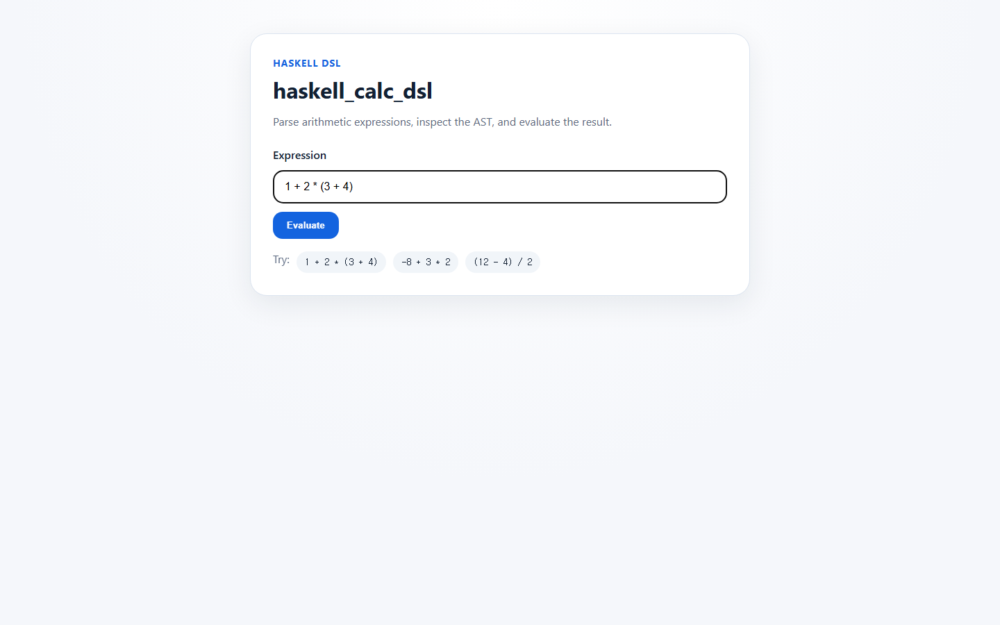
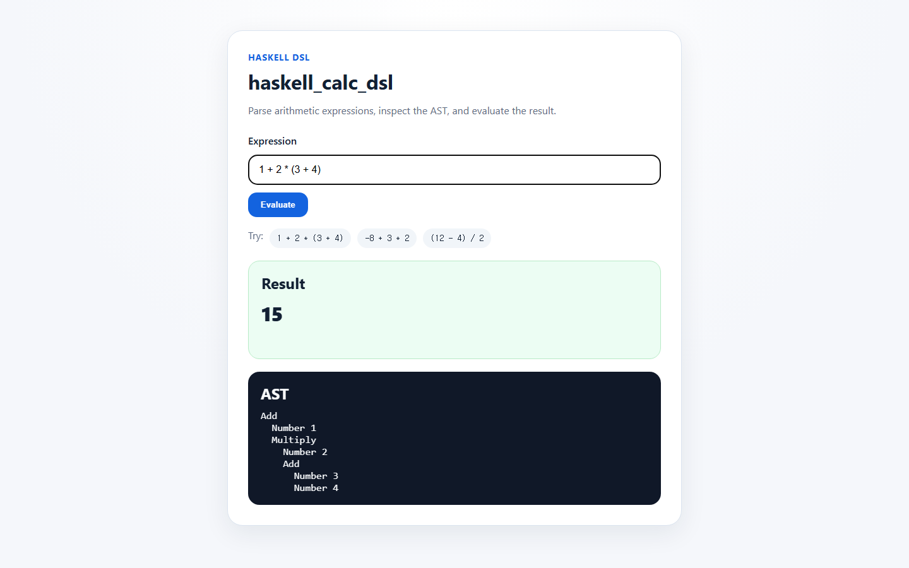
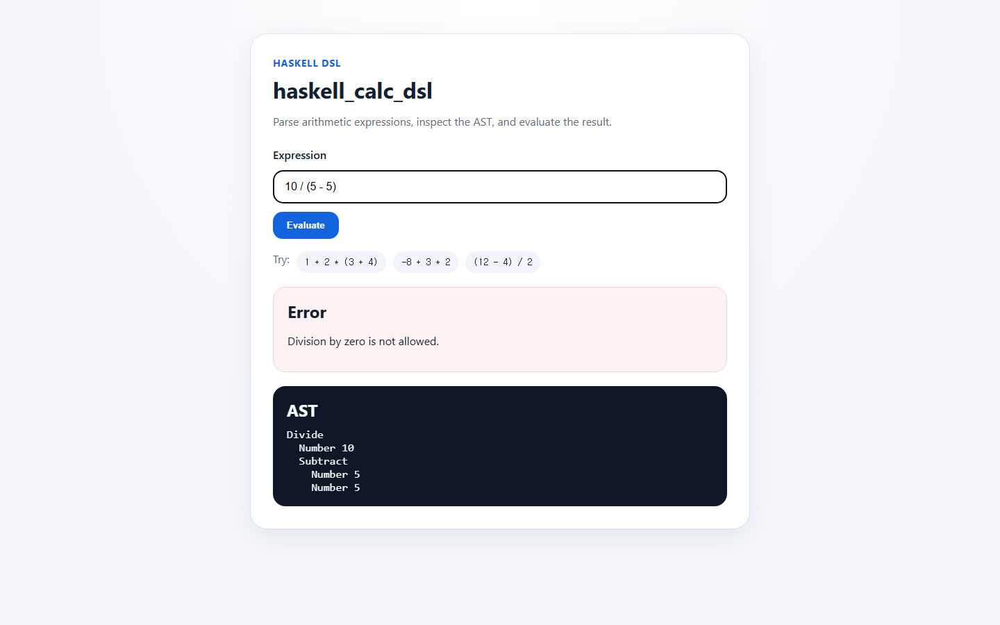

# haskell_calc_dsl

Haskell로 구현한 산술 표현식 DSL 파서, AST 평가기, 그리고 미니멀 웹 UI 프로젝트.

## 데모 설명

`haskell_calc_dsl`은 로컬 웹 서버를 실행한 뒤 간단한 계산기 화면을 렌더링하고, 사용자가 입력한 산술 표현식을 파싱해서 계산 결과를 보여준다. 서버는 `Megaparsec`로 입력 문자열을 AST로 변환하고, 별도의 평가기 모듈에서 트리를 계산한 뒤 결과값 또는 사람이 읽기 쉬운 오류 메시지를 반환한다.

기본 동작 흐름은 다음과 같다.

1. `1 + 2 * (3 + 4)` 같은 표현식을 입력한다.
2. 폼을 제출한다.
3. 결과 카드와 생성된 AST 블록을 확인한다.
4. 파싱 또는 평가에 실패하면 오류 패널을 확인한다.

## 스크린샷

아래 이미지는 실제 실행 중인 앱을 캡처한 결과다.

### 홈 화면

첫 화면은 의도적으로 단순하게 구성했다. 입력 필드 하나, 실행 버튼 하나, 그리고 바로 시도해 볼 수 있는 예시 표현식 몇 개만 배치해 파서 동작을 빠르게 확인할 수 있다.



### 정상 계산 예시

`1 + 2 * (3 + 4)`를 제출하면 최종 계산 결과와 생성된 AST를 함께 보여준다. 덕분에 파싱과 평가 흐름을 한 화면에서 확인할 수 있다.



### 오류 처리 예시

`10 / (5 - 5)`처럼 평가가 실패하는 입력이 들어오면 전용 오류 패널을 렌더링한다. 동시에 AST는 그대로 보여 주기 때문에 디버깅과 설명에 도움이 된다.



## 기술 스택

- Haskell
- `Megaparsec`로 파싱 및 연산자 우선순위 처리
- `Scotty`로 경량 로컬 웹 서버 구성
- `blaze-html`로 서버 사이드 HTML 렌더링
- `Stack` / `cabal`로 빌드 및 실행

## 파서 설계 설명

### AST

핵심 AST는 `CalcDsl.Ast` 모듈에 정의되어 있다.

```haskell
data Expr
    = Number Integer
    | Negate Expr
    | Add Expr Expr
    | Subtract Expr Expr
    | Multiply Expr Expr
    | Divide Expr Expr
```

이 구조는 문법 표현을 명시적으로 유지해 주고, 평가 로직이 파서 구현 세부사항에 의존하지 않도록 분리해 준다.

### 파서 조합기

`CalcDsl.Parser`는 `Megaparsec`의 `makeExprParser`를 사용해 우선순위와 결합 방향을 구성한다.

- prefix: 단항 음수
- multiplicative: `*`, `/`
- additive: `+`, `-`

괄호는 작은 `parens` 조합기로 처리하고, 숫자는 `Megaparsec` lexer 헬퍼로 읽어들인다. 파서의 결과가 오직 `Expr` AST이기 때문에, 평가기는 원본 문자열 형식을 알 필요 없이 트리만 계산하면 된다.

## 주요 기능

- 연산자 우선순위와 괄호가 포함된 산술 표현식 파싱
- 타입이 명확한 AST 생성
- 전용 평가기 모듈에서 수식 계산
- 파싱 오류와 0으로 나누기 오류를 분리해 처리
- 최소한의 웹 UI에서 결과와 AST를 함께 표시
- 공백과 단항 음수 입력 지원

## 실행 방법

### `stack`으로 실행

```bash
stack run
```

실행 후 [http://localhost:3000](http://localhost:3000)으로 접속하면 된다.

### `cabal`로 실행

이미 `cabal-install`과 GHC가 설치되어 있다면 다음처럼 실행할 수 있다.

```bash
cabal update
cabal run
```

프로젝트에는 `.cabal` 패키지 정의와 생성된 `stack.yaml`이 함께 포함되어 있다.

## 예시 표현식

- `1 + 2 * (3 + 4)` -> `15`
- `-8 + 3 * 2` -> `-2`
- `(12 - 4) / 2` -> `4`
- `7 / 3` -> `2.3333333333`
- `10 / (5 - 5)` -> 0으로 나누기 오류

## 향후 개선 아이디어

- HTML 폼과 함께 사용할 JSON API 엔드포인트 추가
- 변수와 let-binding을 포함하도록 DSL 확장
- 파서/평가기 round-trip을 위한 property test 추가
- 순환 소수 표현을 더 잘 다루는 숫자 렌더링 개선
- 실시간 계산을 위한 클라이언트 측 점진적 향상 추가
