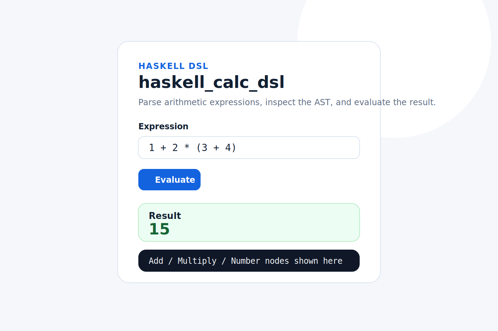

# haskell_calc_dsl

Tiny arithmetic DSL in Haskell with a parser, AST evaluator, and a minimal browser UI.

## Demo explanation

`haskell_calc_dsl` starts a local web server, renders a small calculator page, and evaluates arithmetic expressions entered in the form. The server parses the input into an AST with `Megaparsec`, evaluates the tree with a separate evaluator module, and returns either the computed result or a human-readable error.

Typical flow:

1. Enter an expression such as `1 + 2 * (3 + 4)`.
2. Submit the form.
3. Inspect the result card and the generated AST block.
4. If parsing or evaluation fails, read the error panel.

## Screenshots (expected UI)



The shipped UI is intentionally small and clean:

- one input field
- one evaluate button
- a result panel
- an error panel when parsing fails
- an AST panel to show the parsed tree

## Tech stack

- Haskell
- `Megaparsec` for parsing and operator precedence handling
- `Scotty` for the lightweight local web server
- `blaze-html` for server-side HTML rendering
- `cabal` for build/run workflow

## Parser design explanation

### AST

The core AST lives in `CalcDsl.Ast`:

```haskell
data Expr
    = Number Integer
    | Negate Expr
    | Add Expr Expr
    | Subtract Expr Expr
    | Multiply Expr Expr
    | Divide Expr Expr
```

This keeps syntax representation explicit and makes evaluation independent from parsing.

### Combinators

`CalcDsl.Parser` uses `Megaparsec` and `makeExprParser` to model precedence and associativity:

- prefix: unary minus
- multiplicative: `*`, `/`
- additive: `+`, `-`

Parentheses are parsed with a small `parens` combinator, and numbers are lexed with `megaparsec`'s lexer helpers. Because parsing only produces `Expr`, the evaluator never needs to know about raw source text.

## Features

- Parses arithmetic expressions with precedence and parentheses
- Builds a typed AST
- Evaluates expressions in a dedicated evaluator module
- Returns parse errors and division-by-zero errors separately
- Shows both result and AST in a minimal web UI
- Supports whitespace and unary negation

## How to run

### With stack

```bash
stack run
```

Then open [http://localhost:3000](http://localhost:3000).

### With cabal

If you already have `cabal-install` and GHC available:

```bash
cabal update
cabal run
```

The project includes both a `.cabal` package definition and a generated `stack.yaml`.

## Example expressions

- `1 + 2 * (3 + 4)` -> `15`
- `-8 + 3 * 2` -> `-2`
- `(12 - 4) / 2` -> `4`
- `7 / 3` -> `2.3333333333`
- `10 / (5 - 5)` -> division-by-zero error

## Future improvements

- Add a JSON API endpoint alongside the HTML form
- Extend the DSL with variables and let-bindings
- Add property tests for parser/evaluator round-trips
- Improve numeric rendering for repeating decimals
- Add client-side progressive enhancement for live evaluation
